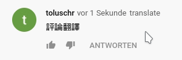

# YouTube-Comment-Translate

## Usage

## Installation
[Download](YouTube-Comment-Translate/releases/latest/) and extract the newest release.

### Chromium Browsers

#### Chrome, Chromium
Go to chrome://extensions/.

#### Opera 
Go to opera:extensions.
---
Enable `Developer mode` and click on `Load unpacked`.
Navigate to the folder you extracted to and click `open`. Disable `Developer mode`.

### Other Browsers

#### Firefox
Added soon ...
