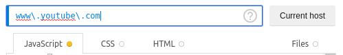

<h1 align="center">YouTube-Comment-Translate</h1>

	  
		<a href="https://chrome.google.com/webstore/detail/youtube-comment-translate/alaejlmlpgcffloicejpccebbeeibemo">
			
	  

<!-- vim-markdown-toc GFM -->

* [Usage](#usage)
	* [Changing the language](#changing-the-language)
* [Installation](#installation)
* [Manual Install](#manual-install)
	* [Javascript injector](#javascript-injector)
	* [Chromium](#chromium)
	* [Other](#other)

<!-- vim-markdown-toc -->

## Usage
After installing, this button will appear next to every comment 

### Changing the language
The default language is english (en). To change it, open the plugins setting page (`chrome://extensions/?options=alaejlmlpgcffloicejpccebbeeibemo`)
and change the Target Language. Alternatively, if using the plugin via a JavaScript injector, manually edit `inject.js` and change line 5 (`TARGET_LANGUAGE`) to the desired language.
[But what letters should I set it to?](https://www.gnu.org/software/gettext/manual/html_node/Usual-Language-Codes.html)

## Installation
When using chrome or any chromium based browser, simply download the extension from the webstore.

## Manual Install
### Javascript injector
Since this plugin was developed using just a simple content script, one can simply inject it using a [Javascript injector](https://github.com/Lor-Saba/Code-Injector).
This is also the recommended method for firefox users. Use this pattern: `www\.youtube\.com`

### Chromium
Open the following url in your browser
<table>
	<tr>
		<td align="right"><b>Browser</b></td>
		<td align="center"></td>
		<td align="center"></td>
		<td align="center"></td>
		<td align="center"></td>
		<td align="center"></td>
	</tr>
	<tr>
		<td align="right"><b>Url</b></td>
		<td align="center">chrome://extensions</td>
		<td align="center">chrome://extensions</td>
		<td align="center">opera:extensions</td>
		<td align="center">chrome://extensions</td>
		<td align="center">vivaldi://extensions</td>
	</tr>
</table>

---

Enable `Developer mode` and click on `Load unpacked`.
Navigate to the folder you extracted to and click `open`. Disable `Developer mode`.

### Other
<table>
	<tr>
		<td align="right"><b>Browser</b></td>
		<td align="center"></td>
		<td align="center"></td>
		<td align="center"></td>
		<td align="center"></td>
	</tr>
	<tr>
		<td align="right"><b>Install</b></td>
		<td align="center">JavaScript Injector</td>
		<td align="center">JavaScript Injector</td>
		<td align="center">JavaScript Injector</td>
		<td align="center">JavaScript Injector</td>
	</tr>
</table>

---

The icons used in the README are from the open-source [papirus-icon-theme](https://github.com/PapirusDevelopmentTeam/papirus-icon-theme) project
